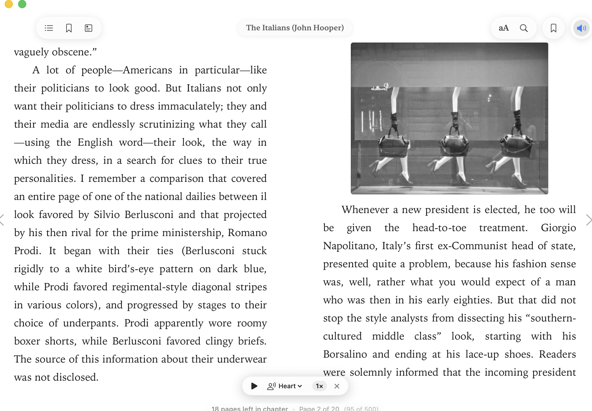

<p align="center">
  
</p>

# Booksy

Native macOS EPUB and PDF reader with offline speech synthesis.

[](https://www.apple.com/macos/)
[](https://swift.org)
[](https://github.com/hexgrad/kokoro)
[](https://huggingface.co/Qwen)
[](LICENSE)

---

## Download

Download [Booksy-Installer.pkg](Booksy-Installer.pkg).

Double-click the installer to place Booksy in `/Applications`. It runs on Apple Silicon and Intel Macs on macOS 13 or later.

---

## Reader View

<p align="center">
  
</p>

---

## Features

### Resume reading from current view
Pressing play starts speech synthesis from the paragraph visible in your current spread instead of restarting the chapter. Layout calculations resolve the left-hand column first and skip trailing single-line overflow from previous pages.

### Offline speech synthesis
- Kokoro 82M runs locally on CPU or Metal without external API calls or network requests.
- Eleven voices are included (such as `af_heart`, `am_adam`, `bf_alice`, and `bm_fable`) with playback speeds from 0.75x to 2.0x.
- Lingua detects inline foreign-language phrases, and a local Qwen 2.5 model parses dialogue versus narrative structure to adjust phrasing.

### Responsive pagination
- Wide windows display two columns side by side. Narrow or portrait windows collapse to a single centered page.
- Margin and column gap calculations prevent text from bleeding across column edges.
- Page progress and chapter counts update when you resize the window or change font size.

### Typography and themes
- Fonts: Original book styles, SF Pro, New York, Georgia, and Palatino.
- Spacing: Configurable font size, line height, letter spacing, word spacing, and text justification.
- Four themes: White, Sepia, Gray, and Night.
- Annotations: Five highlight colors, underlines, text notes, and plain text copying.
- In-page search via Command-F.

### Catalog search
Search and download public-domain titles directly from Project Gutenberg through the Gutendex catalog.

---

## Architecture

```
┌────────────────────────────────────────────────────────┐
│                   Booksy macOS App                     │
│         SwiftUI UI • AppKit Core • WKWebView Reader    │
└───────────────────────────┬────────────────────────────┘
                            │ Process Pipe / JSON IPC
┌───────────────────────────▼────────────────────────────┐
│                    Python Subsystem                    │
│   • speak_chapter.py    - Kokoro Neural TTS Synthesis  │
│   • context_director.py - Language Detection & Routing │
│   • epub_metadata.py    - Spine & TOC Extraction       │
│   • read_chapter.py     - Clean Content Extraction     │
└────────────────────────────────────────────────────────┘
```

The app handles rendering and user interactions in Swift. Audio synthesis runs in a Python background process that streams audio chunks while processing subsequent sentences.

---

## Building from source

### Prerequisites
- macOS 13.0 or newer
- Xcode Command Line Tools (`xcode-select --install`)
- Python 3.10 or newer

### Python dependencies
```bash
pip install kokoro sounddevice beautifulsoup4 lingua-language-detector torch numpy
```

### Build and package
```bash
git clone https://github.com/youssefbouhaik/Booksy.git
cd Booksy
chmod +x package_app.sh
./package_app.sh
```

The script compiles the Swift sources, builds `/Applications/Booksy.app`, applies the icon, and generates `Booksy-Installer.pkg`.

---

## Keyboard shortcuts

| Shortcut | Action |
| :--- | :--- |
| `Right Arrow` / `Space` / `Page Down` | Next page or spread |
| `Left Arrow` / `Page Up` | Previous page or spread |
| `Cmd + F` | Search within chapter |
| `Cmd + B` | Bookmark current page |
| `Cmd + T` | Open table of contents |
| `Cmd + ,` | Open theme and typography settings |

---

## Acknowledgements and license

- Matthew Andrea D'Alessio for the original Swift Apple Books reader base.
- Kokoro TTS for the neural speech synthesis model.
- Qwen team for language models.
- Project Gutenberg and Gutendex for public domain books.

Distributed under the [MIT License](LICENSE).
